# Homodyne v2 Architecture Flow Chart - Current Implementation

```mermaid
flowchart TD
    %% Entry Points
    User["`👤 **User Entry Points**
    - CLI Commands (homodyne.cli)
    - Python API (homodyne.api)
    - Configuration Files (YAML/JSON)`"] --> Entry{Entry Method?}

    Entry -->|Python API| API["`📚 **Python API**
    homodyne.api.*
    - run_analysis()
    - fit_data()
    - quick_vi_fit()
    - quick_mcmc_fit()
    - AnalysisSession`"]

    Entry -->|CLI Commands| CLI["`💻 **CLI Interface**
    homodyne.cli.*
    - main.py: Entry point
    - commands.py: Command handlers
    - args_parser.py: Argument parsing
    - validators.py: Input validation`"]

    Entry -->|Configuration| Config["`⚙️ **Configuration System**
    homodyne.config.*
    - manager.py: ConfigManager
    - parameters.py: Parameter definitions
    - modes.py: Analysis mode detection
    - Templates: v1_json/, v2_yaml/`"]

    Entry -->|Data Files| DataLoader["`📊 **Data Loading**
    homodyne.data.*
    - xpcs_loader.py: XPCSDataLoader
    - HDF5/NPZ support
    - JAX array conversion
    - Caching system`"]

    %% Workflow Orchestration
    API --> Workflow["`🔄 **Analysis Workflows**
    homodyne.workflows.*
    - AnalysisPipeline: Main orchestrator
    - MethodExecutor: Method execution controller
    - ResultsManager: Results handling
    - PlottingController: Visualization`"]

    CLI --> Workflow
    Config --> Workflow
    DataLoader --> Workflow

    %% Configuration Flow
    Config --> ParamSpace["`📏 **Parameter Space**
    homodyne.core.fitting
    - Static Isotropic: D₀, α, D_offset
    - Static Anisotropic: D₀, α, D_offset + filtering
    - Laminar Flow: + γ̇₀, β, γ̇_offset, φ₀
    - Bounds & Priors Definition`"]

    %% Core Engine
    Workflow --> CoreEngine["`🔬 **Core Engine**
    homodyne.core.*

    **Physical Model:**
    g₂(φ,t₁,t₂) = offset + contrast × [g₁(φ,t₁,t₂)]²

    **Components:**
    - models.py: DiffusionModel, ShearModel, CombinedModel
    - theory.py: g₁ calculations
    - fitting.py: Unified fitting engine
    - physics.py: Physical constants & validation`"]

    ParamSpace --> CoreEngine

    %% JAX Backend
    CoreEngine --> JAXBackend["`⚡ **JAX Computational Backend**
    homodyne.core.jax_backend

    **JIT-Compiled Functions:**
    - compute_g1_diffusion()
    - compute_g1_shear()
    - compute_g2_scaled()
    - gradient_g2()
    - hessian_g2()

    **Features:**
    - GPU/TPU Acceleration
    - Automatic Differentiation
    - Vectorized Operations`"]

    JAXBackend -->|Fallback| NumPy["`🔢 **NumPy Fallback**
    When JAX unavailable
    - Pure NumPy implementation
    - Reduced performance
    - Same API interface`"]

    %% Runtime Management
    JAXBackend --> Runtime["`🖥️ **Runtime Management**
    homodyne.runtime.*
    - gpu/: GPU acceleration & memory management
    - shell/: Shell integration
    - utils/: Performance utilities`"]

    %% Optimization Methods
    CoreEngine --> OptChoice{"`🎯 **Optimization Method Selection**
    homodyne.optimization.*`"}

    OptChoice -->|Primary Method| VI["`🎲 **Variational Inference**
    homodyne.optimization.variational
    
    **VariationalInferenceJAX:**
    - KL Divergence Minimization
    - 10-100x faster than classical
    - Approximate posterior + uncertainties
    - ELBO optimization with Adam`"]

    OptChoice -->|High Accuracy| MCMC["`🎰 **MCMC Sampling**
    homodyne.optimization.mcmc
    
    **MCMCJAXSampler:**
    - NumPyro/BlackJAX NUTS
    - Full posterior samples
    - JAX-accelerated chains
    - Convergence diagnostics`"]

    OptChoice -->|Best of Both| Hybrid["`🔄 **Hybrid Optimization**
    homodyne.optimization.hybrid
    
    **HybridOptimizer:**
    - VI → MCMC pipeline
    - Fast exploration + refinement
    - Automatic quality control
    - Resource adaptive allocation`"]

    %% GPU Acceleration through Runtime
    VI --> Runtime
    MCMC --> Runtime
    Hybrid --> Runtime

    Runtime --> GPU{"`🚀 **Hardware Optimization**`"}

    GPU -->|Available| GPUOpt["`🖥️ **GPU Processing**
    - JAX GPU backend
    - Memory management
    - Hardware benchmarking
    - Method-specific tuning`"]

    GPU -->|Fallback| CPUOpt["`💻 **CPU Processing**
    - JAX CPU backend
    - Optimized threading
    - Memory-efficient algorithms`"]

    %% Results Processing
    VI --> Results["`📊 **Results Management**
    homodyne.results.*
    - exporters.py: Export utilities
    - VIResult / MCMCResult / HybridResult
    - Parameter estimates & uncertainties
    - Fit statistics & diagnostics`"]

    MCMC --> Results
    Hybrid --> Results
    GPUOpt --> Results
    CPUOpt --> Results

    %% Output and Visualization
    Results --> Plotting["`📈 **Visualization**
    homodyne.plotting.*
    - Correlation plots
    - Parameter distributions
    - Convergence diagnostics
    - Performance monitoring`"]

    Results --> Export["`💾 **Export & Output**
    - YAML/JSON export
    - NPZ arrays
    - HDF5 format
    - Performance logs`"]

    %% Plugin System
    CoreEngine -.-> Plugins["`🔌 **Plugin System**
    homodyne.plugins.*
    - data_formats/: Custom data loaders
    - models/: Additional physical models
    - optimizers/: Custom optimization methods`"]

    %% HPC Integration
    Workflow --> HPC["`🏔️ **HPC Integration**
    homodyne.hpc.*
    - job_templates/: PBS Professional templates
    - Distributed computing support
    - Resource management`"]

    %% Utilities and Monitoring
    CoreEngine -.-> Logging["`📝 **Enhanced Logging**
    homodyne.utils.*
    - logging.py: Basic logging
    - jax_logging.py: JAX-specific logging
    - scientific_logging.py: Scientific context
    - distributed_logging.py: Distributed systems
    - production_monitoring.py: Performance tracking
    - advanced_debugging.py: Debug tools`"]

    %% Styling
    classDef entry fill:#e1f5fe,stroke:#0277bd,stroke-width:2px
    classDef config fill:#f3e5f5,stroke:#7b1fa2,stroke-width:2px
    classDef data fill:#e8f5e8,stroke:#388e3c,stroke-width:2px
    classDef core fill:#fff3e0,stroke:#f57c00,stroke-width:2px
    classDef optimization fill:#ffebee,stroke:#d32f2f,stroke-width:2px
    classDef results fill:#e0f2f1,stroke:#00695c,stroke-width:2px
    classDef hardware fill:#fce4ec,stroke:#c2185b,stroke-width:2px
    classDef workflow fill:#f1f8e9,stroke:#689f38,stroke-width:2px

    class User,Entry,API,CLI entry
    class Config,ParamSpace config
    class DataLoader data
    class CoreEngine,JAXBackend,NumPy core
    class OptChoice,VI,MCMC,Hybrid optimization
    class Results,Plotting,Export results
    class Runtime,GPU,GPUOpt,CPUOpt hardware
    class Workflow workflow
```

## Key Architecture Updates - Current Implementation

### 1. **Entry Point Architecture**
- **CLI Interface**: Complete command-line interface with argument parsing and validation
- **Python API**: High-level and convenience APIs for programmatic access
- **Configuration System**: YAML-first with JSON backward compatibility

### 2. **Workflow Orchestration Layer**
**NEW**: `homodyne.workflows.*` provides complete analysis orchestration:
- **AnalysisPipeline**: Main workflow coordinator
- **MethodExecutor**: Controls optimization method execution
- **ResultsManager**: Handles results processing and export
- **PlottingController**: Coordinates visualization

### 3. **Enhanced Runtime Management**
**NEW**: `homodyne.runtime.*` manages execution environment:
- **GPU Management**: Hardware detection and optimization
- **Shell Integration**: Command-line tool integration
- **Performance Utilities**: Runtime optimization tools

### 4. **Plugin Architecture**
**NEW**: `homodyne.plugins.*` enables extensibility:
- **Data Formats**: Custom data loader plugins
- **Models**: Additional physical model implementations
- **Optimizers**: Custom optimization method plugins

### 5. **HPC Integration**
**NEW**: `homodyne.hpc.*` provides high-performance computing support:
- **Job Templates**: PBS Professional integration
- **Distributed Computing**: Multi-node processing capabilities

### 6. **Enhanced Logging System**
**EXPANDED**: `homodyne.utils.*` includes comprehensive monitoring:
- **JAX-specific logging**: JAX operation tracking
- **Scientific logging**: Experiment context tracking
- **Distributed logging**: Multi-process coordination
- **Production monitoring**: Performance metrics
- **Advanced debugging**: Development tools

### 7. **Results Management**
**NEW**: `homodyne.results.*` provides structured result handling:
- **Export utilities**: Multiple format support
- **Result objects**: Structured data containers with metadata

## Current Architecture Principles

1. **Layered Architecture**
   - Entry Points → Workflows → Core → Backend → Hardware
   - Clear separation of concerns with well-defined interfaces

2. **JAX-First Design**
   - All computational cores use JAX with NumPy fallbacks
   - Hardware-agnostic with automatic GPU/TPU acceleration

3. **Plugin-Based Extensibility**
   - Modular design allowing custom components
   - Easy integration of new models and optimization methods

4. **Workflow-Driven Execution**
   - Centralized orchestration through workflow system
   - Consistent execution patterns across entry points

5. **Enterprise-Ready**
   - HPC integration for large-scale computing
   - Comprehensive logging and monitoring
   - Production-grade error handling and debugging

6. **Backward Compatibility**
   - Full v1 CLI compatibility
   - Gradual migration path for existing users

This updated architecture reflects the current sophisticated implementation with proper separation of concerns, comprehensive workflow management, and enterprise-ready features while maintaining the core physics and optimization principles.