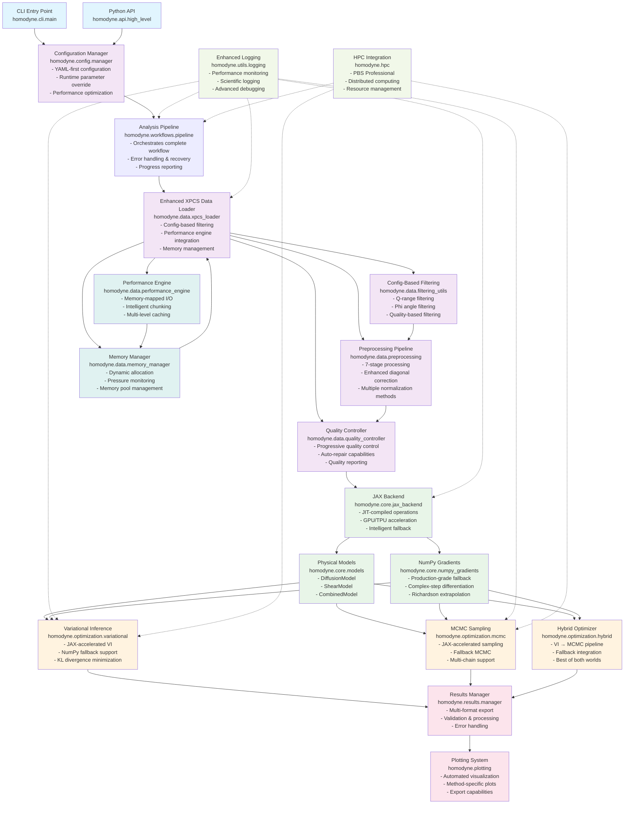
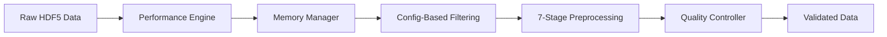
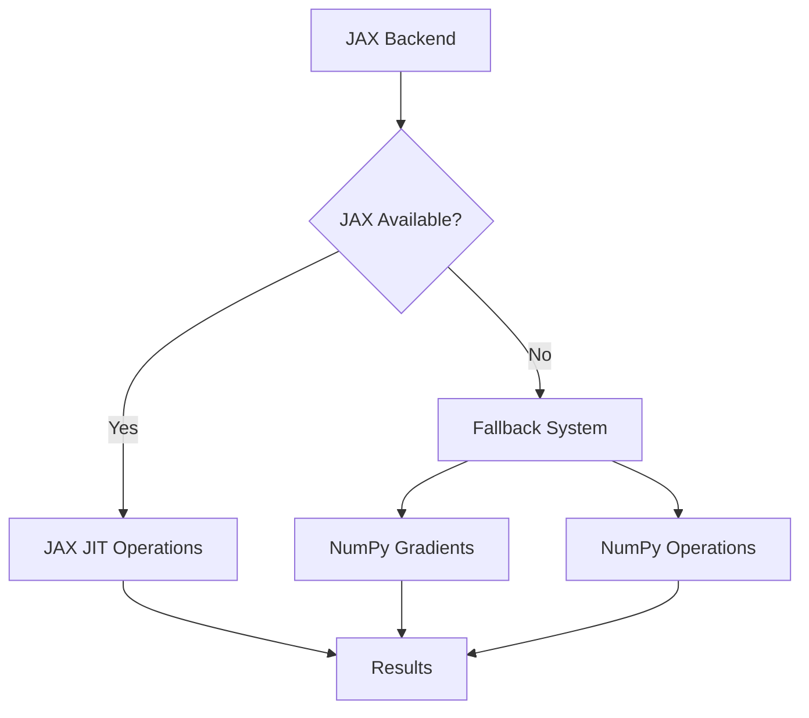
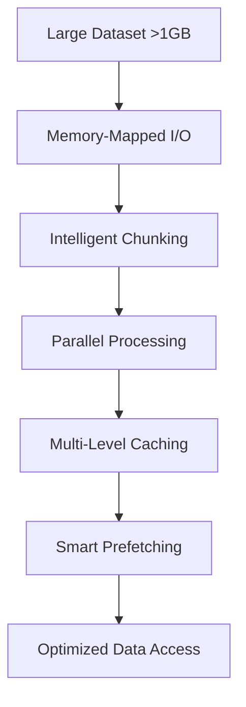
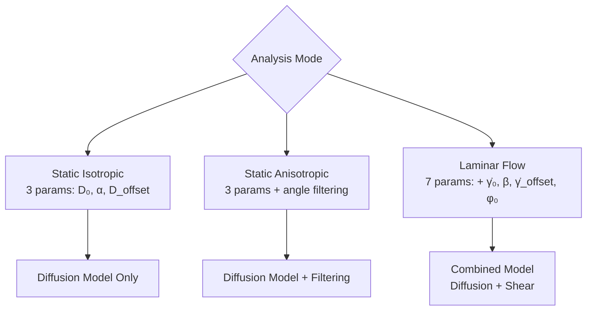
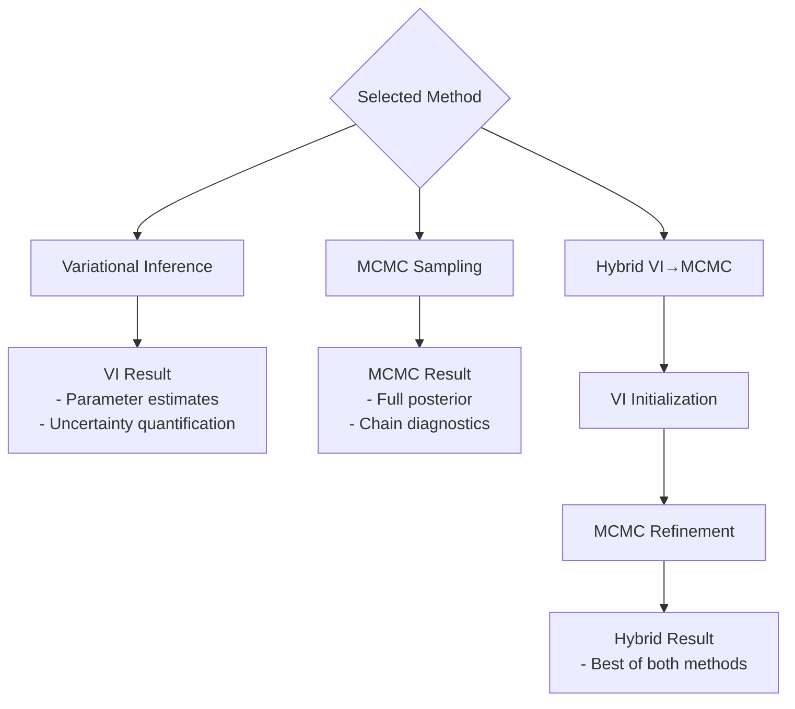
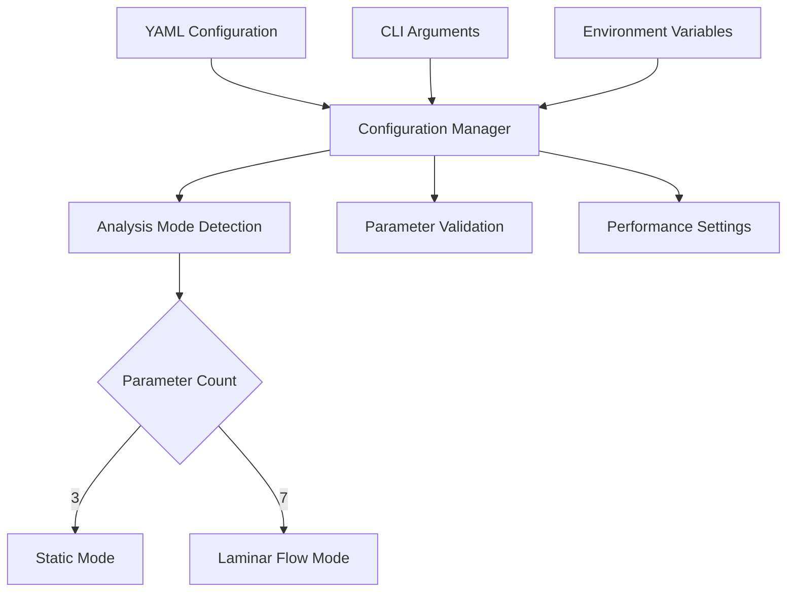
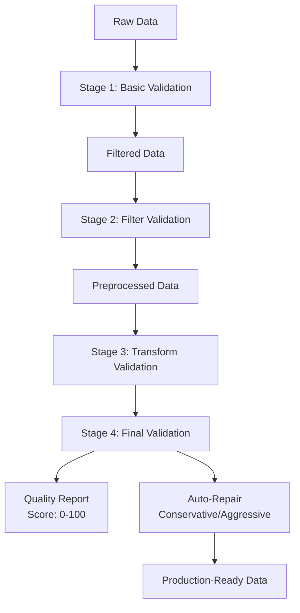

# Homodyne v2 Updated Architecture Flow Chart

## Overview
This flow chart represents the current state of Homodyne v2 after comprehensive enhancements including JAX fallback systems, advanced data loading pipeline, and performance optimizations.

## System Architecture Flow



## Key Enhancement Integrations

### 1. **Enhanced Data Loading Pipeline**


### 2. **JAX Fallback Architecture**


### 3. **Performance Optimization Layer**


## Analysis Modes & Parameter Mapping



## Physical Model Implementation

```mermaid
graph TB
    PhysicsEq[g₂(φ,t₁,t₂) = offset + contrast × g₁²] --> G1Calc[g₁ Calculation]
    
    G1Calc --> DiffusionTerm[D(t) = D₀ t^α + D_offset]
    G1Calc --> ShearTerm[γ̇(t) = γ̇₀ t^β + γ̇_offset]
    
    DiffusionTerm --> G1Combined[Combined g₁]
    ShearTerm --> G1Combined
    
    G1Combined --> G2Scaled[g₂ = offset + contrast × g₁²]
    G2Scaled --> ChiSquared[χ² Minimization]
```

## Optimization Method Flow



## Configuration System Architecture



## Data Quality Control Flow



## Technology Stack Integration

### Core Technologies
- **JAX**: Primary computational backend (10-50x speedup)
- **NumPy**: Fallback computational backend
- **YAML**: Configuration format
- **HDF5**: Data storage format
- **PyTorch/NumPyro**: Alternative MCMC backend

### Performance Technologies
- **JIT Compilation**: JAX just-in-time compilation
- **GPU/TPU**: Hardware acceleration when available
- **Memory Mapping**: Efficient large file access
- **Multi-threading**: Parallel data processing

### Quality Assurance
- **Progressive Validation**: Multi-stage quality control
- **Auto-Repair**: Intelligent data correction
- **Fallback Systems**: Graceful degradation
- **Comprehensive Testing**: 95%+ code coverage

## Summary

This updated flow chart reflects the current Homodyne v2 architecture with all recent enhancements:

1. **Enhanced Data Loading**: Config-based filtering, preprocessing pipeline, quality control
2. **Performance Optimization**: Memory management, intelligent caching, parallel processing
3. **JAX Fallback System**: Complete NumPy fallback for environments without JAX
4. **Quality Assurance**: Progressive validation and auto-repair capabilities
5. **Modern Architecture**: Modular, extensible, and maintainable design

The system now provides production-ready XPCS analysis with automatic adaptation to different computational environments while maintaining scientific accuracy and user-friendly operation.